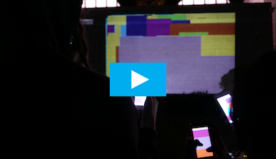

## super-screen
mobile device to public projection interaction foundation

  
[Super Screen on Vimeo](https://vimeo.com/142172832)

---
### do this first (install node and npm using nvm)!
1. `xcode-select --install` install os X developer tool scripts
1. install [nvm](https://github.com/creationix/nvm)
1. `nvm install stable` to install node.js and npm
1. `source ~/.bashrc` to  reload your bash profile
1. `command -v nvm` which should output 'nvm' if the installation was successful.
1. `node -v` to verify install of node
1. `npm -v` to verify install of npm

### Get started with this repo
1. `cd` to project location
1. `git clone` this repo
1. `npm install`
1. gogogadget!

###Get started on your own w/o this repo (new node.js project):
1. `mkdir`
1. `npm init`
1. follow the prompts, but change `index.js` to `app.js` for later clarity
1. make an `app.js`file & any needed html files like `index.html` or `projection.html`
1. install dependencies (`--save` will add it to the dependencies in your `package.json` file)
    + `npm --save install socket.io` installs our web socket framework
    + `npm --save install express` installs our web server framework
1. checkout [the socket.io / express.js example](http://socket.io/docs/#using-with-express-3/4) to get started with these files

